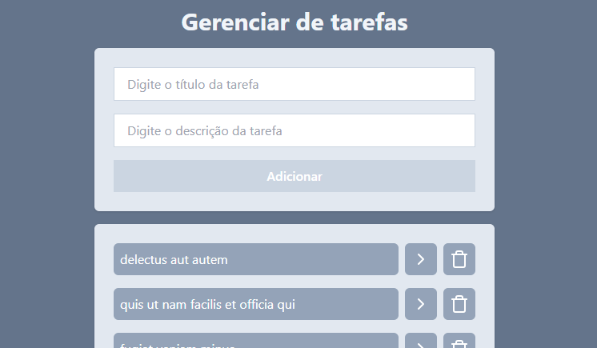

# 📋 Gerenciador de Tarefas

Aplicação web para criar, visualizar e gerenciar tarefas, desenvolvida como projeto prático de aprendizado de React. O projeto explora o funcionamento de componentes, estilização com Tailwind CSS e consumo de API REST.


---

## 📸 Demonstração



---

## ✅ Funcionalidades

- Criação de novas tarefas
- Listagem de tarefas existentes
- Remoção de tarefas
- Detalhes das tarefas
- Consumo de API externa

---

## 🚀 Como executar

### Pré-requisitos

- [Node.js](https://nodejs.org/) >= 18
- [Git](https://git-scm.com/)

### Instalação

```bash
# Clone o repositório
git clone https://github.com/mauricioamaraldev/first-project-react-learning.git

# Acesse a pasta do projeto
cd first-project-react-learning

# Instale as dependências
npm install

# Inicie o servidor de desenvolvimento
npm run dev
```

A aplicação estará disponível em `http://localhost:5173`

---

## 🌐 API utilizada

Este projeto consome a [JSONPlaceholder](https://jsonplaceholder.typicode.com/), uma API REST gratuita para fins de prototipagem e aprendizado.

---

## 📚 O que aprendi

- Criação e composição de componentes React
- Gerenciamento de estado com `useState` e `useEffect`
- Estilização com classes utilitárias do Tailwind CSS
- Requisições HTTP e consumo de API com `fetch`
- Configuração de ambiente com Vite

---

## 👨‍💻 Autor

Feito por **Maurício Amaral**

[](https://linkedin.com/in/mauricioamaraldev)
[](https://github.com/mauricioamaraldev)
